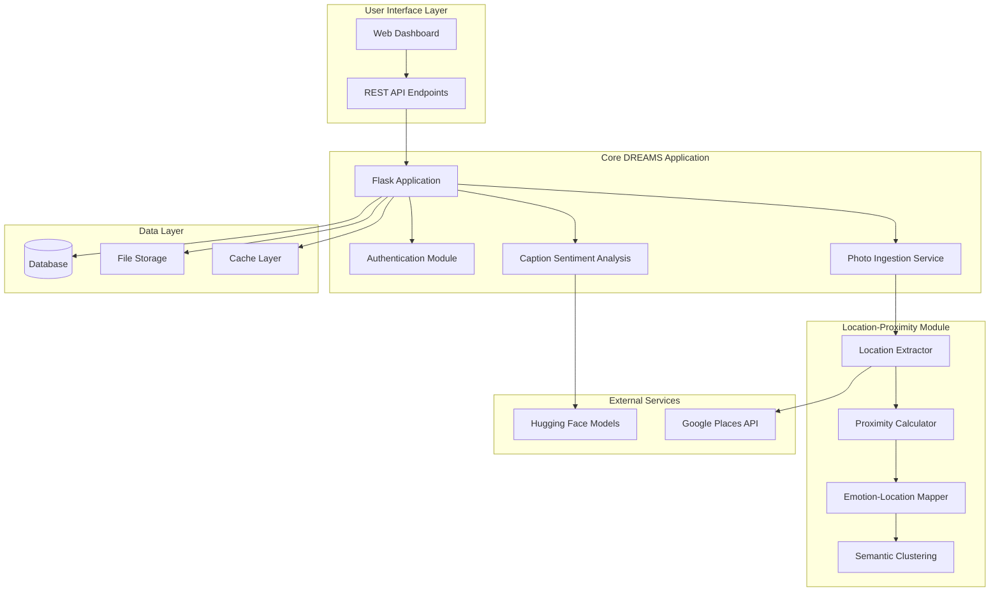
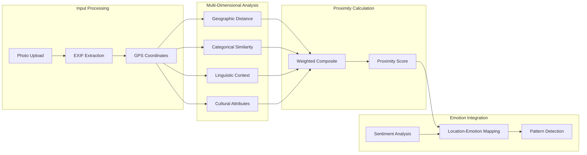
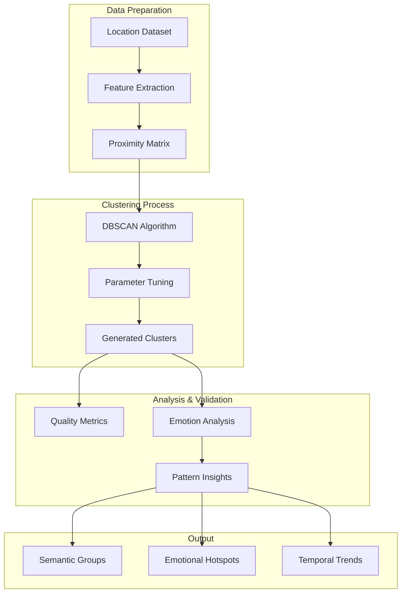

# DREAMS Architecture Overview

## System Architecture



## Location-Proximity Pipeline



## Semantic Clustering Workflow



## Component Integration Points

### 1. Photo Ingestion Integration
```
dreamsApp/app/ingestion/routes.py
├── Extract EXIF data from uploaded photos
├── Call location_proximity.location_extractor
└── Store location data in post schema
```

### 2. Dashboard Integration
```
dreamsApp/app/dashboard/main.py
├── Location analysis endpoints
├── Proximity visualization routes
└── Emotion-location pattern displays
```

### 3. API Extensions
```
/api/v1/locations/proximity
├── Calculate proximity between locations
├── Return multi-dimensional scores
└── Support batch processing
```

## Data Flow Architecture

### Input Data Sources
- **Photo EXIF**: GPS coordinates, timestamp, camera metadata
- **User Captions**: Text for sentiment analysis
- **External APIs**: Place type information, cultural context

### Processing Layers
1. **Extraction Layer**: GPS, metadata, place information
2. **Analysis Layer**: Multi-dimensional proximity calculation
3. **Mapping Layer**: Emotion-location pattern detection
4. **Clustering Layer**: Semantic grouping and insights

### Output Interfaces
- **REST API**: Programmatic access to proximity data
- **Dashboard**: Visual analytics and pattern exploration
- **Database**: Persistent storage of computed relationships

## Scalability Considerations

### Performance Optimization
- **Caching**: Proximity calculations for frequently accessed locations
- **Batch Processing**: Bulk analysis for large photo collections
- **Indexing**: Spatial indexing for geographic queries

### Extensibility Points
- **Plugin Architecture**: Additional proximity dimensions
- **Model Integration**: Custom ML models for place recognition
- **API Versioning**: Backward compatibility for evolving features

## Security & Privacy

### Data Protection
- **Location Privacy**: Configurable precision levels
- **User Consent**: Explicit permission for location analysis
- **Data Retention**: Configurable storage policies

### Access Control
- **Authentication**: User-specific location data
- **Authorization**: Role-based access to analytics
- **Audit Logging**: Track access to sensitive location information

## Technology Stack

### Core Technologies
- **Backend**: Python Flask, SQLAlchemy
- **Analysis**: NumPy, scikit-learn, Pandas
- **Visualization**: Matplotlib, Folium (future)
- **Database**: PostgreSQL (recommended), SQLite (development)

### External Dependencies
- **Image Processing**: Pillow (EXIF extraction)
- **ML Models**: Hugging Face Transformers
- **Geospatial**: Haversine distance calculations
- **Clustering**: DBSCAN implementation

## Development Phases

### Phase 1: Foundation (Current)
- Multi-dimensional proximity calculation
- Basic emotion-location mapping
- DBSCAN clustering implementation
- Comprehensive testing suite

### Phase 2: Integration
- DREAMS application integration
- REST API development
- Dashboard visualization
- Performance optimization

### Phase 3: Enhancement
- Advanced ML models
- Real-time processing
- Interactive visualizations
- Cross-user analysis capabilities

---

**Note**: This architecture document provides a high-level overview without implementation details. Specific implementation decisions will be made during the development phase based on performance requirements and integration constraints.