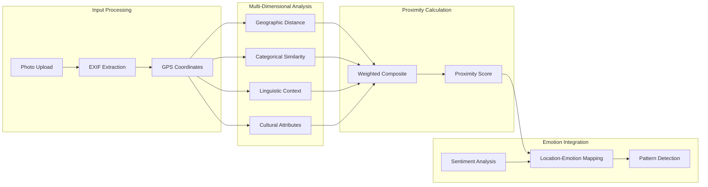
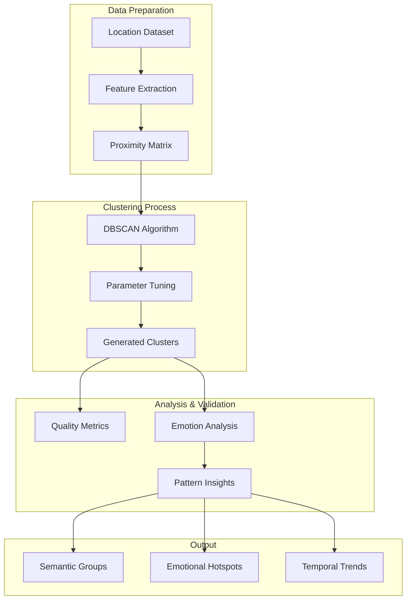

# DREAMS Architecture Overview

**Note**: This document provides a high-level system architecture overview. For detailed implementation of the DREAMS application components, see `dreamsApp/docs/architecture.md`.

## System Architecture

```
Dreams

┌─────────────────────────────────────────────────────────────────┐
│                         USER INTERFACE                          │
│  (Beehive Frontend - Photo Upload with Captions)                │
└────────────────────────────┬────────────────────────────────────┘
                             │
                             ▼
┌─────────────────────────────────────────────────────────────────┐
│                      DREAMS API LAYER                           │
│  ┌──────────────────────────────────────────────────────────┐   │
│  │  Upload Route: /upload                                   │   │
│  │  - Receives: Image + Caption + Timestamp                 │   │
│  │  - Returns: Post ID + Sentiment + Location               │   │
│  └──────────────────────────────────────────────────────────┘   │
└────────────────────────────┬────────────────────────────────────┘
                             │
                             ▼
┌─────────────────────────────────────────────────────────────────┐
│                   PROCESSING PIPELINE                           │
│                                                                 │
│  ┌─────────────────┐  ┌──────────────────┐  ┌────────────────┐  │
│  │ Image Analysis  │  │ Text Analysis    │  │ Location       │  │
│  │                 │  │                  │  │ Analysis       │  │
│  │ • BLIP Caption  │  │ • Sentiment      │  │ • GPS Extract  │  │
│  │ • DeepFace      │  │ • Keywords       │  │ • Proximity    │  │
│  │   Emotion       │  │ • Clustering     │  │ • Patterns     │  │
│  └────────┬────────┘  └────────┬─────────┘  └────────┬───────┘  │
│           │                    │                     │          │
│           └────────────────────┴─────────────────────┘          │
│                                │                                │
└────────────────────────────────┼────────────────────────────────┘
                                 │
                                 ▼
┌────────────────────────────────────────────────────────────────┐
│               LOCATION-PROXIMITY MODULE (GSoC 2026)            │
│         Building upon PR #77 (EXIF) & PR #70 (Emotion)        │
│                                                                │
│  ┌──────────────────────────────────────────────────────────┐  │
│  │  1. Location Extractor (uses existing EXIFExtractor)     │  │
│  │     Input: Image file                                    │  │
│  │     Output: {lat, lon, timestamp}                        │  │ 
│  │     Tech: Pillow EXIF parsing (from PR #77)              │  │
│  └──────────────────────────────────────────────────────────┘  │
│                              │                                 │
│                              ▼                                 │
│  ┌──────────────────────────────────────────────────────────┐  │
│  │  2. Place Enrichment (Optional - Future)                 │  │
│  │     Input: {lat, lon}                                    │  │
│  │     Output: {place_type, name, language, cultural_tags}  │  │
│  │     Tech: Google Places API / Nominatim                  │  │
│  └──────────────────────────────────────────────────────────┘  │
│                              │                                 │
│                              ▼                                 │
│  ┌──────────────────────────────────────────────────────────┐  │
│  │  3. Proximity Calculator                                 │  │
│  │     Input: Place1, Place2                                │  │
│  │     Output: Proximity score (0-1)                        │  │
│  │                                                          │  │
│  │     Components:                                          │  │
│  │     • Geographic: Haversine distance                     │  │
│  │     • Categorical: Place type matching                   │  │
│  │     • Linguistic: Language similarity                    │  │
│  │     • Cultural: Tag similarity (Jaccard)                 │  │
│  │     • Composite: Weighted combination                    │  │
│  └──────────────────────────────────────────────────────────┘  │
│                              │                                 │
│                              ▼                                 │
│  ┌──────────────────────────────────────────────────────────┐  │
│  │  4. Emotion-Location Mapper                              │  │
│  │     Input: location_id, sentiment, score, metadata       │  │
│  │     Storage: In-memory dictionary                        │  │
│  │     Note: Temporary storage for prototype; should be     │  │
│  │           moved to persistent database (MongoDB) for     │  │
│  │           production scalability and data persistence.   │  │
│  │                                                          │  │
│  │     Functions:                                           │  │
│  │     • add_entry()                                        │  │
│  │     • get_location_sentiment_profile()                   │  │
│  │     • find_emotional_hotspots()                          │  │
│  │     • compare_place_types()                              │  │
│  │     • temporal_emotion_trend()                           │  │
│  └──────────────────────────────────────────────────────────┘  │
│                              │                                 │
│                              ▼                                 │
│  ┌──────────────────────────────────────────────────────────┐  │
│  │  5. Semantic Clustering                                  │  │
│  │     Input: Proximity matrix + Emotion profiles           │  │
│  │     Algorithm: DBSCAN                                    │  │
│  │     Output: Cluster labels + Emotion statistics          │  │
│  │                                                          │  │
│  │     Parameters:                                          │  │
│  │     • eps: 0.3-0.5 (neighborhood distance)               │  │
│  │     • min_samples: 2-3 (core point threshold)            │  │
│  └──────────────────────────────────────────────────────────┘  │
└────────────────────────────┬───────────────────────────────────┘
                             │
                             ▼
┌─────────────────────────────────────────────────────────────────┐
│                      DATA STORAGE LAYER                         │
│                                                                 │
│  ┌───────────────────────────────────────────────────────────┐  │
│  │  MongoDB Collections:                                     │  │
│  │                                                           │  │
│  │  • posts: {                                               │  │
│  │      user_id, caption, timestamp, image_path,             │  │
│  │      sentiment: {label, score},                           │  │
│  │      location: {lat, lon, place_type, language}           │  │
│  │    }                                                      │  │
│  │                                                           │  │
│  │  • keywords: {                                            │  │
│  │      user_id,                                             │  │
│  │      positive_keywords: [{keyword, embedding, timestamp}],│  │
│  │      negative_keywords: [{keyword, embedding, timestamp}] │  │
│  │    }                                                      │  │
│  │                                                           │  │
│  │  • location_analysis: {                                   │  │
│  │      user_id,                                             │  │
│  │      locations: [{id, lat, lon, visits, emotions}],       │  │
│  │      clusters: [{id, members, emotion_dist}],             │  │
│  │      hotspots: [{location_id, sentiment, confidence}]     │  │
│  │    }                                                      │  │
│  │                                                           │  │
│  │  • thematic_analysis: {                                   │  │
│  │      user_id,                                             │  │
│  │      data: {positive: [{theme: string,                    │  │
│  │             interpretation: string}],                     │  │
│  │             negative: [{theme: string,                    │  │
│  │             interpretation: string}]}                     │  │
│  │    }                                                      │  │
│  └───────────────────────────────────────────────────────────┘  │
└────────────────────────────┬────────────────────────────────────┘
                             │
                             ▼
┌────────────────────────────────────────────────────────────────┐
│                    VISUALIZATION LAYER                         │
│                                                                │
│  ┌──────────────────────────────────────────────────────────┐  │
│  │  Dashboard Routes:                                       │  │
│  │                                                          │  │
│  │  • /dashboard/<user_id>                                  │  │
│  │    - Sentiment timeline                                  │  │
│  │    - Word clouds                                         │  │
│  │    - Thematic cards                                      │  │
│  │                                                          │  │
│  │  • /location_analysis/<user_id>  (NEW)                   │  │
│  │    - Emotional hotspots map                              │  │
│  │    - Place type comparison chart                         │  │
│  │    - Location clusters visualization                     │  │
│  │    - Temporal-spatial patterns                           │  │
│  │                                                          │  │
│  │  • /clusters/<user_id>                                   │  │
│  │    - Cluster details                                     │  │
│  │    - Member locations                                    │  │
│  │    - Emotion distributions                               │  │
│  └──────────────────────────────────────────────────────────┘  │
└────────────────────────────────────────────────────────────────┘
```

## Location-Proximity Pipeline



## Semantic Clustering Workflow



## Component Integration Points

### 1. Photo Ingestion Integration

**`dreamsApp/app/ingestion/routes.py`**
- Extract EXIF data from uploaded photos
- Call `location_proximity.location_extractor`
- Store location data in post schema

### 2. Dashboard Integration

**`dreamsApp/app/dashboard/main.py`**
- Location analysis endpoints
- Proximity visualization routes
- Emotion-location pattern displays

### 3. API Extensions

**`/api/v1/locations/proximity`**
- Calculate proximity between locations
- Return multi-dimensional scores
- Support batch processing

## Data Flow Architecture

### Input Data Sources
- **Photo EXIF**: GPS coordinates, timestamp, camera metadata
- **User Captions**: Text for sentiment analysis
- **External APIs**: Place type information, cultural context

### Processing Layers
1. **Extraction Layer**: GPS, metadata, place information
2. **Analysis Layer**: Multi-dimensional proximity calculation
3. **Mapping Layer**: Emotion-location pattern detection
4. **Clustering Layer**: Semantic grouping and insights

### Output Interfaces
- **REST API**: Programmatic access to proximity data
- **Dashboard**: Visual analytics and pattern exploration
- **Database**: Persistent storage of computed relationships

## Scalability Considerations

### Performance Optimization
- **Caching**: Proximity calculations for frequently accessed locations
- **Batch Processing**: Bulk analysis for large photo collections
- **Indexing**: Spatial indexing for geographic queries

### Extensibility Points
- **Plugin Architecture**: Additional proximity dimensions
- **Model Integration**: Custom ML models for place recognition
- **API Versioning**: Backward compatibility for evolving features

## Security & Privacy

### Data Protection
- **Location Privacy**: Configurable precision levels
- **User Consent**: Explicit permission for location analysis
- **Data Retention**: Configurable storage policies

### Access Control
- **Authentication**: User-specific location data
- **Authorization**: Role-based access to analytics
- **Audit Logging**: Track access to sensitive location information

## Technology Stack

### Core Technologies
- **Backend**: Python Flask, SQLAlchemy
- **Analysis**: NumPy, scikit-learn, Pandas
- **Visualization**: Matplotlib, Folium (future)
- **Database**: MongoDB (recommended), SQLite (development)

### External Dependencies
- **Image Processing**: Pillow (EXIF extraction)
- **ML Models**: Hugging Face Transformers
- **Geospatial**: Haversine distance calculations
- **Clustering**: DBSCAN implementation

## Development Phases

### Phase 1: Foundation (Current)
- Multi-dimensional proximity calculation
- Basic emotion-location mapping
- DBSCAN clustering implementation
- Comprehensive testing suite

### Phase 2: Integration
- DREAMS application integration
- REST API development
- Dashboard visualization
- Performance optimization

### Phase 3: Enhancement
- Advanced ML models
- Real-time processing
- Interactive visualizations
- Cross-user analysis capabilities

---

**Note**: This architecture document provides a high-level overview without implementation details. Specific implementation decisions will be made during the development phase based on performance requirements and integration constraints.