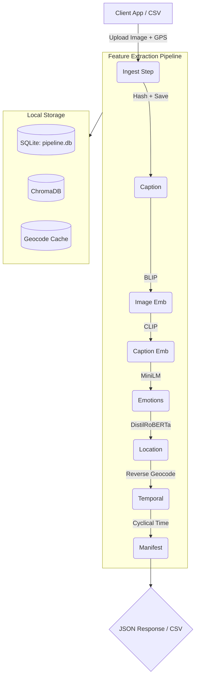

# DREAMS Analysis Pipeline

A production-ready, fault-tolerant feature extraction pipeline for the DREAMS project.

This module is the core ingestion engine for the DREAMS platform. It accepts real-world user images (with metadata like GPS and timestamps), intelligently extracts rich multimodal features using deep learning, and prepares the data for advanced behavioral and emotional clustering.

---

## 📑 Table of Contents

1. [Key Capabilities & Improvements](#-key-capabilities--improvements)
2. [Architecture Overview](#-architecture-overview)
3. [Pipeline Steps](#-pipeline-steps)
4. [Storage Model](#-storage-model)
5. [Quick Start (Batch Processing)](#-quick-start-batch-processing)
6. [REST API (Async Ingestion)](#-rest-api-async-ingestion)
7. [Analysis JSON Schema](#-analysis-json-schema)
8. [Setup & Configuration](#-setup--configuration)
9. [Future Roadmap](#-future-roadmap)

---

## 🚀 Key Capabilities & Improvements

This pipeline represents a massive upgrade over prior experimental iterations:

*   **Asynchronous API & Worker Queue:** Images uploaded via the API are immediately enqueued in a SQLite-backed queue, returning a 202 instantly while ML processing happens in a background thread.
*   **Per-Record Error Recovery:** If a step fails (e.g., API timeout), the pipeline resumes from the exact failure point on the next run rather than crashing the whole batch.
*   **Duplicate Detection:** Computes perceptual hashes (average hash) for every image. Near-identical photos are flagged and skipped, saving massive compute time.
*   **Intelligent Geocode Caching:** A local SQLite cache (`geocode_cache.db`) stores Nominatim reverse-geocode responses. The same coordinates are never queried twice, preventing API rate limits.
*   **Comprehensive Emotional Profiling:** Extracts 7 discrete emotions, valence/arousal, sentiment (positive/negative/neutral), and CHIME recovery categories using DistilRoBERTa.
*   **Multimodal Embeddings:** Extracts 512D CLIP vectors for images and 384D MiniLM vectors for captions, storing both in a local ChromaDB instance.
*   **Idempotency & Snapshots:** Safe to run multiple times. Generates deterministic `memory_id`s.

---

## 🏗 Architecture Overview

The pipeline supports two modes of operation:
1.  **Batch Mode (`__main__.py`)**: Processes a massive CSV of images locally.
2.  **API Mode (`api/app.py`)**: Exposes an async `/api/ingest` endpoint for the web/mobile app.



---

## ⚙️ Pipeline Steps

| Step | Description |
|------|-------------|
| `ingest` | Generates deterministic `memory_id`, computes perceptual hash for duplicate detection, extracts EXIF GPS if provided GPS is null. |
| `caption` | Generates text descriptions for images using `Salesforce/blip-image-captioning-base`. Skipped if user provided a manual caption. |
| `image_embeddings` | Generates 512-dimensional visual feature vectors using `CLIP (ViT-B/32)` and saves to ChromaDB. |
| `caption_embeddings` | Generates 384-dimensional semantic text vectors using `all-MiniLM-L6-v2` and saves to ChromaDB. |
| `emotions` | Runs NLP models over the text to extract: 7 emotions, valence/arousal, 3-class sentiment, and CHIME categories. |
| `location` | Reverse-geocodes latitude/longitude into city, state, country, and place_category. Backed by local SQLite cache to prevent rate-limiting. |
| `temporal` | Calculates cyclical sin/cos encoding for hour, day, and month, plus relative recovery day calculations. |
| `manifest` | Generates a final quality report, checking completeness % and identifying null values or step failures. |

---

## 💾 Storage Model

Data is strictly divided by its query pattern to optimize performance without requiring heavy external databases (like Postgres or Pinecone) during local development.

1.  **Structured Data (`pipeline.db`)**: SQLite databases containing `memories`, `emotion_scores`, `temporal_features`, `location_info`, and async `ingest_queue` states.
2.  **Vector Store (`chromadb/`)**: Local ChromaDB instance containing `image_embeddings` and `caption_embeddings` collections.
3.  **Cache (`geocode_cache.db`)**: Dedicated SQLite database storing raw JSON responses from the Nominatim API.
4.  **Processed Images (`data/processed/`)**: The sanitized, original images saved by their `memory_id` for easy web serving.

---

## 💻 Quick Start (Batch Processing)

For bulk processing of historical user data or synthetic datasets:

```bash
# install dependencies
pip install -r analysis_pipeline/requirements.txt

# run full pipeline on a CSV dataset
python -m analysis_pipeline data/raw/dataset.csv

# run with CSV export of the master manifest
python -m analysis_pipeline data/raw/dataset.csv --export output/manifest.csv

# run only specific steps
python -m analysis_pipeline data/raw/dataset.csv --only ingest emotions temporal

# skip heavy ML steps during rapid development testing
python -m analysis_pipeline data/raw/dataset.csv --skip image_embeddings caption
```

### Expected CSV Format
```csv
id,user_id,image_filename,category,latitude,longitude,date,caption
1,user_123,photo.jpg,Park,61.2058,-149.9141,2026-03-07 11:00:00,"Walked around the park today"
```
*(Images must be placed in the same directory as the CSV, or inside an `images/` subfolder).*

---

## 🌐 REST API (Async Ingestion)

The API service runs by default on **Port 5001** to isolate long-running ML workloads from the main web application.

To start the API server and background worker:
```bash
python -m analysis_pipeline.api
```

### 1. `POST /api/ingest`
Upload an image. Returns instantly with a job ID while processing happens in the background.

*   **Content-Type:** `multipart/form-data`
*   **Fields:** `image` (file, req), `user_id` (text, req), `caption`, `latitude`, `longitude`, `timestamp`.

### 2. `GET /api/status/<job_id>`
Poll the status of a background job (`queued`, `processing`, `done`, `error`).

### 3. `GET /api/analysis/<memory_id>`
Fetch the beautifully formatted, unified JSON manifest for a single memory, bringing together SQLite data and ChromaDB vector references. Pass `?include_embeddings=true` to get the raw vectors.

---

## 📋 Analysis JSON Schema

The output is stable and designed for the downstream Research Phases.

```json
{
  "memory_id": "7d52af1678e2557b",
  "user_id": "anish123",
  "captured_at": "2026-03-01T11:33:43+00:00",
  "caption_source": "user",
  "emotions": {
    "dominant_emotion": "joy",
    "discrete": { "joy": 0.94, "neutral": 0.03 },
    "sentiment": { "label": "positive", "positive": 0.98 },
    "chime": { "category": "Hope", "confidence": 0.997 }
  },
  "location": {
    "latitude": 61.2181,
    "longitude": -149.9003,
    "place_type": "post_box",
    "address": { "city": "Anchorage", "state": "Alaska", "country": "United States" }
  },
  "temporal": {
    "hour": 11,
    "day_of_week": 6,
    "season": "spring",
    "recovery_day": 0.0,
    "cyclical": { "sin_hour": 0.26, "cos_hour": -0.97 }
  },
  "embeddings": {
    "image": { "collection": "image_embeddings", "dimensions": 512 },
    "caption": { "collection": "caption_embeddings", "dimensions": 384 }
  },
  "processing_status": "complete"
}
```

---

## 🛠 Setup & Configuration

All core configurations are managed in `analysis_pipeline/config.py`.

*   To wipe all databases, vectors, and state to start fresh, run:
    ```bash
    python -m analysis_pipeline.erase_past_rec
    ```

### Known Limitations (Windows)
If you encounter `OSError: The paging file is too small... (os error 1455)`, it means your system ran out of RAM when loading PyTorch models. The pipeline mitigates this by aggressively unloading models from RAM after each step (`del model; gc.collect()`), but you may need to increase your Windows Virtual Memory Paging File if issues persist.

---

## 🗺 Future Roadmap

This pipeline is the foundational ingestion engine for three major phases of DREAMS research:

1.  **Phase 1 (Multimodal Clustering)**: Using the JSON outputs to perform HDBSCAN clustering over the fused image, text, and temporal vectors to automatically discover behavioral "concepts".
2.  **Phase 2 (Sequential Pattern Analysis)**: Analyzing transition probabilities (e.g., Does visiting an anxiety-inducing environment followed by a calming environment show a different emotional outcome than two anxiety-inducing visits in a row?).
3.  **Phase 3 (Emotional Prediction)**: Training a sequence prediction model to estimate emotional direction based on location and behavioral history patterns.
