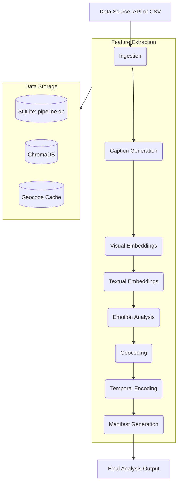

# DREAMS Analysis Pipeline

This module is the core ingestion and feature extraction engine for the DREAMS platform. It processes user images, extracts multimodal features using deep learning, and prepares data for place similarity modeling

---

## Table of Contents

1. [Capabilities and Functional Improvements](#capabilities-and-functional-improvements)
2. [Architecture](#architecture)
3. [Pipeline Steps](#pipeline-steps)
4. [Storage Model](#storage-model)
5. [Batch Processing](#batch-processing)
6. [REST API](#rest-api)
7. [Analysis JSON Schema](#analysis-json-schema)
8. [Configuration and Maintenance](#configuration-and-maintenance)
9. [Development Roadmap](#development-roadmap)

---

## Capabilities and Functional Improvements

This implementation provides several technical enhancements over previous experimental versions:

*   **Asynchronous Processing:** Images uploaded via the API are managed through a SQLite-backed worker queue. This allows the API to return immediate responses while feature extraction proceeds in a background thread.
*   **Fault Tolerance:** Processing is tracked at the record level. If a specific step fails, the pipeline can resume from the last successful state without re-processing the entire dataset.
*   **Duplicate Detection:** Average-hash perceptual hashing identifies near-identical images to prevent redundant computation.
*   **Geocode Caching:** A local SQLite cache (`geocode_cache.db`) stores reverse-geocoding results. This minimizes external API calls and prevents rate-limiting issues.
*   **Multi-Model Feature Extraction:** The pipeline extracts 512D CLIP vectors for images, 384D MiniLM vectors for text, 7-class emotion probabilities, valence/arousal scores, and CHIME categories.
*   **Idempotency:** The system uses deterministic identifiers for records, ensuring consistent state across multiple runs.

---

## Architecture

The module supports two primary interfaces:
1.  **Batch Mode (`__main__.py`)**: For local processing of datasets via CSV.
2.  **API Mode (`api/app.py`)**: A REST service for real-time ingestion.



---

## Pipeline Steps

| Step | Function |
|------|----------|
| `ingest` | Generates record IDs, performs duplicate checks, and extracts EXIF metadata. |
| `caption` | Generates descriptions using BLIP-base if no user caption is provided. |
| `image_embeddings` | Computes visual feature vectors using CLIP. |
| `caption_embeddings` | Computes semantic vectors for captions using MiniLM. |
| `emotions` | Extracts emotional, sentiment, and CHIME metrics from text. |
| `location` | Performs reverse-geocoding with local caching. |
| `temporal` | Encodes timestamps into cyclical and relative features. |
| `manifest` | Verifies data completeness and generates processing reports. |

---

## Storage Model

Data storage is partitioned by access pattern:

1.  **Structured Data (`pipeline.db`)**: Stores primary records, emotional metrics, and queue state in SQLite.
2.  **Vector Store (`chromadb/`)**: Stores high-dimensional embeddings for similarity search.
3.  **Geocode Cache (`geocode_cache.db`)**: Persists external API responses for location data.
4.  **Image Repository (`data/processed/`)**: Stores original media indexed by record ID.

---

## Batch Processing

To process historical data or large datasets:

```bash
# Install required dependencies
pip install -r analysis_pipeline/requirements.txt

# Execute full pipeline on a CSV dataset
python -m analysis_pipeline data/raw/dataset.csv

# Execute specific steps (e.g., ingestion and emotions only)
python -m analysis_pipeline data/raw/dataset.csv --only ingest emotions

# Execute while skipping heavy ML steps
python -m analysis_pipeline data/raw/dataset.csv --skip image_embeddings caption
```

### CSV Format Requirements
The input CSV should include: `user_id`, `image_filename`, `latitude`, `longitude`, `date`, and `caption`.

---

## REST API

The API service facilitates asynchronous data ingestion. By default, it operates on **Port 5001**.

Start the server and background worker:
```bash
python -m analysis_pipeline.api
```

### Endpoints

*   **`POST /api/ingest`**: Submits an image for processing. Returns a `job_id`.
*   **`GET /api/status/<job_id>`**: Returns the current state of a task.
*   **`GET /api/analysis/<memory_id>`**: Returns the unified analysis manifest. Use `?include_embeddings=true` to include raw vectors.

---

## Analysis JSON Schema

The output is a standardized JSON object containing extracted features:

```json
{
  "memory_id": "7d52af1678e2557b",
  "user_id": "user_01",
  "captured_at": "2026-03-01T11:33:43+00:00",
  "embeddings": {
        "caption": {
            "dimensions": 384,
            "vector": [
                0.06326521933078766,
                -0.02270640805363655,...
            ]
        },
        "image": {
            "dimensions": 512,
            "vector": [
                0.005213847849518061,
                -0.0337228924036026,...
            ]
        }
    },
  "emotions": {
    "dominant_emotion": "joy",
    "discrete": { "joy": 0.94, "neutral": 0.03 },
    "sentiment": { "label": "positive" }
  },
  "location": {
    "latitude": 61.2181,
    "longitude": -149.9003,
    "address": { "city": "Anchorage", "state": "Alaska" }
  },
  "temporal": {
    "hour": 11,
    "season": "spring",
    "cyclical": { "sin_hour": 0.26, "cos_hour": -0.97 }
  },
  "processing_status": "complete"
}
```

---

## Configuration and Maintenance

Settings are managed within `analysis_pipeline/config.py`.

To reset all local databases and processed data:
```bash
python -m analysis_pipeline.erase_past_rec
```

### Implementation Notes (Windows)
To avoid memory errors (`os error 1455`) on systems with limited RAM, the pipeline sequentially loads and unloads models. If errors persist, consider increasing the system paging file size.

---

## Development Roadmap

The pipeline serves as the data foundation for subsequent research phases:

1.  **Phase 1**: Multimodal clustering utilizing fused vectors from images and text to identify behavioral patterns.
2.  **Phase 2**: Sequential analysis of location and emotional transitions to model behavioral trajectories.
3.  **Phase 3**: Development of predictive models for emotional outcomes based on historical behavioral data.
