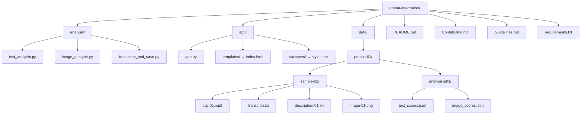

# Contribution Guidelines

Before you begin contributing, kindly take a moment to go through the [Contributing.md](Contributing.md) file.  
It will help you understand the setup, usage, and contribution process more smoothly.

---

## Project Directory Structure

This project is **path-sensitive**. The analysis pipeline, data storage, and Flask UI depend on the folder organization.  
Please do not move or rename critical directories without a solid backing.

---

## A Few Helpful Tips

- **Analysis-related changes** → keep inside `analysis/`
  - (e.g., add a new model wrapper here)
- **UI changes** → only inside `app/` (Flask, templates, CSS)
- **Data** → must follow the `data/<person>/<sample>/` format  
  - Transcripts must be named `transcript.txt`  
  - Outputs will be named `text_scores.json` and `image_scores.json`
- **Do not hardcode paths** — always keep them relative
- **Do not rename folders** — the pipeline depends on consistent names

