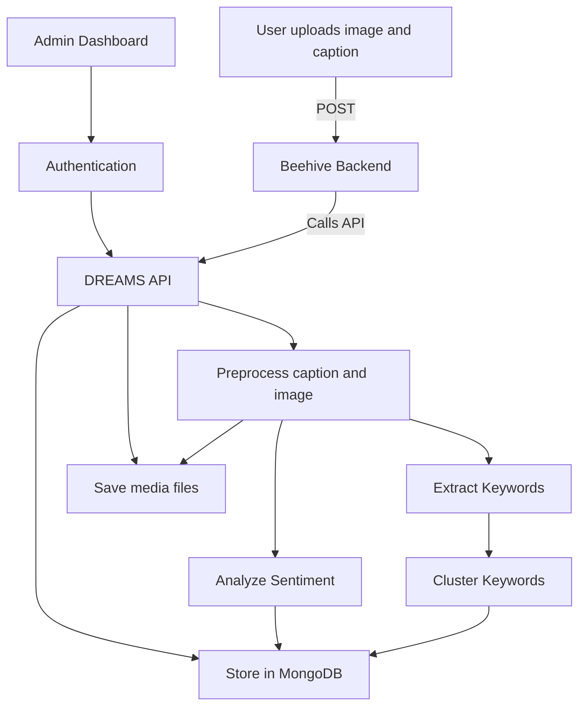

# DREAMS System Architecture

## Overview

DREAMS is a modular, backend-driven platform that processes user-generated image and caption data to extract sentiment, identify themes, and track emotional change over time. The platform is built to be extensible and integrates with Beehive for frontend interaction and story visualization.

---

## High-Level Architecture

The system consists of the following major components:

1.  **Frontend Platform**: (via Beehive or any custom client)
2.  **DREAMS API Backend**
3.  **AI/ML Processing Modules**
4.  **Time-Series-Optimized Database**
5.  **Research/Visualization Interfaces**: (optional)

---

## System Flow

The core data flow, from user interaction to backend storage, is as follows:

`User` → `Beehive Platform` → `DREAMS API` → `ML Modules` → `MongoDB (Time-Aware)` → `Research Dashboard / Visual Analytics`

---

## Component Breakdown

### 1. Frontend (Beehive or Custom)
- Allows users to upload images and provide text captions.
- Sends POST requests to the DREAMS API for analysis.

### 2. DREAMS Ingestion API Backend
- Receives incoming data from the frontend.
- Routes data to appropriate modules:
  - Sentiment analysis
  - Keyword extraction and clustering
  - Thematic analysis (LLM-based, optional)
- Adds timestamp and metadata.
- Stores structured results in the database.
[View Source](../app/ingestion/routes.py)

Frameworks Used:
- Flask (API routing)
- Python (core logic)
- Environment-driven configuration

### 3. ML Modules

#### a. Sentiment Analysis
- **Models Used**:
    - Image Captioning: `Salesforce/blip-image-captioning-large` (BLIP)
    - Sentiment Analysis: `cardiffnlp/twitter-roberta-base-sentiment-latest` (RoBERTa-based model fine-tuned for sentiment classification)

- **Inputs**:
    - Image Path or URL: For generating captions using BLIP.
    - User Caption Text: For sentiment analysis.

- **Processing Pipeline**:
    1. Load image and generate an automatic caption using the BLIP model (optionally combined with a prompt).
    2. Preprocess the user-provided caption.
    3. Run the preprocessed text through the RoBERTa-based sentiment model.
    4. Apply softmax to the logits to get class probabilities.

- **Output**:
    - Image Caption: Generated text describing the uploaded image.
    - Sentiment Label: One of `positive`, `negative`, or `neutral`.
    - Sentiment Score: Probability (softmax confidence) corresponding to the predicted label.

#### b. Keyword Clustering

- **Extraction Pipeline**:
    - Extracts keywords from each caption using:
        - Named entities (PERSON, ORG, LOC, etc.)
        - Noun chunks and individual nouns/proper nouns
    - Employs heuristics to remove noise, redundant substrings, and common stopwords.
    - Embeds keyword candidates using the `all-MiniLM-L6-v2` model from SentenceTransformers.

- **Keyword Structure**:
    - Each extracted keyword is stored with:
        - Vector representation (embedding)
        - Sentiment context (`positive_keywords` or `negative_keywords`)
        - Timestamp (optional, used for temporal tracking)

- **Clustering Algorithm**:
    - Uses HDBSCAN (`min_cluster_size=2`, euclidean distance) to group keyword embeddings into semantic clusters.
    - Operates across all keywords per user (across multiple posts).
    - Does not require predefining the number of clusters (unlike KMeans); detects outliers (label = -1 → marked as "noise").

- **Output Format**:
    - Each clustered keyword is tagged with:
        - `keyword`: extracted phrase
        - `sentiment`: sentiment category from original caption
        - `cluster`: integer cluster ID or "noise" if unassigned

- **Storage**:
    - Clustered results are saved back to each user's document in the `keywords` MongoDB collection under the field `clustered_keywords`.

- **Use Cases**:
    - Reveals recurring emotional themes across time or location.
    - Identifies concept clusters that co-occur with positive or negative emotions.
    - Supports downstream visualization of "emotional hotspots" or recovery patterns.

#### c. Thematic Analysis

- **Model**: Google Gemini (for qualitative theme extraction)

- **Input**: Clustered keywords derived from positive and negative sentiment captions submitted over time.

- **Processing**:
    - For each sentiment type (positive/negative), Gemini identifies 2-3 overarching emotional or experiential themes.
    - Provides short, empathetic interpretations of the participant’s journey.

- **Output**:
    - Structured JSON format stored in MongoDB under the `thematic_analysis` collection, keyed by `user_id`.

- **Use Cases**:
    - Enables researchers and professionals to understand evolving narratives.
    - Offers deeper context for intervention, support, or analysis.
    - Useful for social scientists, mental health practitioners, and recovery program researchers seeking longitudinal emotional insight from user journeys.

### 4. Time-Series-Aware Database
- Database: MongoDB (with indexing for user ID, timestamps, location, and sentiment).
- Stores:
  - Raw post data (image URL, caption, timestamp)
  - Sentiment scores
  - Extracted keywords and cluster ID
  - thematic summaries

### 5. Visualization / Research Interface (Planned)

A web-based dashboard provides real-time insights into users' emotional and thematic patterns.

**Key Features:**

-   **Sentiment Timeline:** Visualizes the evolution of a user's emotional state based on image-caption submissions using a trend chart.
-   **Word Clouds:** Presents frequently occurring words in positive and negative moments, highlighting emotional focus areas.
-   **Thematic Cards:** Displays AI-generated positive and negative themes as interpretive summaries.
-   **Manual Refresh Trigger:** Allows on-demand thematic reanalysis using the latest data.

**Technology Stack:**

-   Flask + Jinja2
-   Dynamic integration with MongoDB and inference APIs

**Target Users:**

-   Mental health researchers
-   Recovery support teams
-   Qualitative analysts

**Use Case:**

-   Interactive monitoring of emotional recovery narratives.
---

## Deployment Considerations

- The backend and ML models can be containerized for deployment using Docker.
- Environment variables are used for secure API key management (e.g., Gemini, MongoDB).
- Storage is modular and can be migrated to cloud databases (e.g., MongoDB Atlas) for scalability.

---

## Extensibility

The DREAMS architecture is intentionally modular. Future extensions may include:

- **Multi-modal analysis** (e.g., facial expressions or tone from audio)
- **Custom LLM finetuning** for recovery-domain narrative modeling
- **Federated deployment** for privacy-preserving research in clinical environments
- **Geo-tagging** Location-Aware Mood Insights

---

## Summary Diagram

